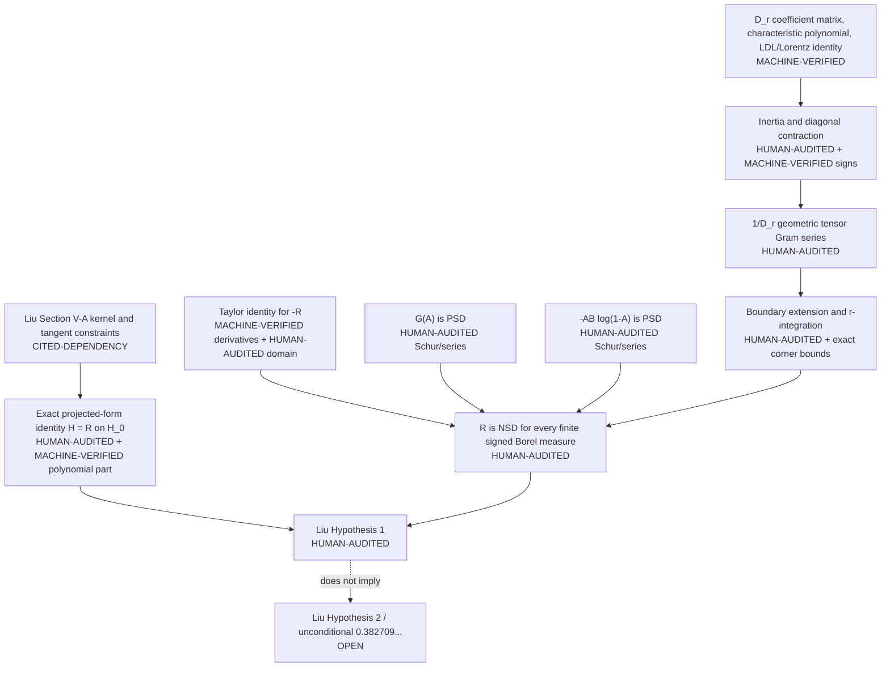

# Audit of Liu Hypothesis 1

**Current scope update (2026-09-06).** The dated Hypothesis-2 `OPEN`
statements below describe what the H1 proof alone establishes, not the
separate current [H2 manuscript](../uc/H2_PAPER/REFEREE.md).
The H1 proof now records its uniform scaled-family corollary in
[`paper/main.tex`](paper/main.tex), Corollary `cor:scaled-h1`.
This is a strengthened explicit scope, not a new frequency bound or novelty claim.

> **Integration update (2026-08-26).** The canonical status wording and
> submission manuscript were revised after this audit: restricted-form
> equality is now distinguished from the stronger unprojected theorem;
> roundoff-scale eigenvalues and the \(0.9999999906\) ratio are labeled
> computational evidence; finite Arb bounds are scoped to finite
> compressions; and Hypothesis 2 remains open.  All four canonical scripts and
> the independent checker were then reproduced in an isolated pinned
> environment; see [`REPRODUCIBILITY.md`](REPRODUCIBILITY.md).  Line references
> in the discrepancy ledger identify the pre-correction snapshot that exposed
> each issue.

## 1. Scope, status vocabulary, and verdict

This audit covers the canonical proof and controls in:

- `uc/liu_kernel.py`;
- `uc/liu_R_nsd.py`;
- `uc/liu_moment_cert.py`;
- `uc/liu_tail.py`;
- the Liu sections of `README.md`, `RESULTS.md`, `PROGRESS.md`, and `uc/README.md`;
- the proof presentation in `uc/paper/main.tex`;
- the submission manuscript `LIU_H1/paper/main.tex`, audited by theorem and equation labels; and
- Liu's primary paper, arXiv:2306.08824v1, especially Section V-A and equations (48), (49), and (78)--(80). A local copy is `LIU_H1/literature/pdfs/liu_2023_arxiv_2306.08824v1.pdf`.

Every substantive conclusion below uses one of these labels:

| Label | Meaning in this audit |
|---|---|
| **MACHINE-VERIFIED** | Checked by exact integer/rational/symbolic/interval arithmetic. This is not a proof-assistant claim unless explicitly stated. |
| **HUMAN-AUDITED** | Re-derived here and checked as a mathematical argument, including hypotheses and endpoints. |
| **COMPUTATIONAL-EVIDENCE** | Sampled, floating-point, truncated, or finite-dimensional evidence only. |
| **CITED-DEPENDENCY** | Taken from the identified primary source or a standard named theorem rather than proved by a repository checker. |
| **OPEN** | Not established by the audited material. |
| **FAILED** | A stated claim is false, stale, too broad, or supported by weaker evidence than its wording says. |

**HUMAN-AUDITED — overall mathematical verdict.** The proof that the reduced kernel `R` is negative semidefinite is sound. Its explicit Taylor decomposition, two elementary positive-kernel series, Lorentz factorization of the remainder denominator, contraction argument, endpoint extensions, nonnegative parameter integration, and passage to finite signed measures form a complete proof of Liu's Section V-A hypothesis.

**MACHINE-VERIFIED — independent algebraic verdict.** `LIU_H1/verification/independent_exact_checker.py`, which imports no canonical proof code and uses no CAS or numerical library, independently checks the polynomial reduction bookkeeping, denominator matrix, determinant, characteristic polynomial, cleared Lorentz identity, sign certificates, corner lower bounds, and the exact Cauchy-kernel counterexample.

**FAILED — principal wording defect, not a proof defect.** Liu's projected hypothesis is not shown to be *equivalent* to negative semidefiniteness of `R` on all signed measures. What is exact is equality of the two quadratic forms on Liu's constrained subspace. Full, unprojected negative semidefiniteness of `R` is a strictly stronger sufficient statement. The canonical proof establishes that stronger statement, so this wording error does not invalidate the conclusion.

**OPEN — scope outside this theorem.** Liu's Section V-B global-minimizer hypothesis is not proved here. Consequently neither the printed decimal `0.382709087918741` nor the equation-defined nearby value is made an unconditional union-closed constant by the Hypothesis 1 proof alone.

## 2. Source audit

| Source | What it actually supplies | Status |
|---|---|---|
| Liu, arXiv:2306.08824v1, Section V-A | The kernel, the two fixed-moment constraints on probability measures, the transformed three homogeneous moment constraints for tangent signed measures, and numerical grid/coefficient checks. | **CITED-DEPENDENCY** |
| `frankl3.m` linked by Liu | `dt=0.0004`, 2,499 interior nodes, and a projector with columns `[1,i/n,s(1-s)]`; the comments distinguish the unsymmetrized and symmetrized roundoff-scale eigenvalues. | **CITED-DEPENDENCY** |
| `uc/liu_kernel.py` | A float64 grid reproduction and printed moment expansion. It has no `assert` and ends “NUMERICAL/STRUCTURAL ONLY.” | **COMPUTATIONAL-EVIDENCE** for the run; **HUMAN-AUDITED** for the separately re-derived reduction |
| `uc/liu_tail.py` | Exact CAS checks for closed forms and finite rational checks for one failed Cauchy--Schwarz budget; sampled high-precision and Nyström controls; printed human arguments for the all-orders obstruction and compactness route. | **MACHINE-VERIFIED** exact parts; **COMPUTATIONAL-EVIDENCE** numerical parts; **HUMAN-AUDITED** analytic parts |
| `uc/liu_moment_cert.py` | Exact finite support-degree matrices, Arb eigenvalue/Cholesky enclosures, rational-node Gram checks, and explicit warnings that none proves the continuum theorem. | **MACHINE-VERIFIED** only for the stated finite objects; continuum claims in its historical output are not proof |
| `uc/liu_R_nsd.py` | Exact symbolic identities for the successful proof, numerical diagnostics, and finite Arb compression majorants. Its analytic kernel and measure conclusions still require the human steps audited here. | **MACHINE-VERIFIED** algebra plus **HUMAN-AUDITED** analysis |
| `LIU_H1/paper/main.tex` | Submission exposition of the finite-signed-measure theorem, restricted-form consequence, exact endpoint proof, evidence separation, and novelty scope. | **HUMAN-AUDITED** by labels mapped in Section 5 |
| `LIU_H1/verification/independent_exact_checker.py` | Independent standard-library exact coefficient checks and stronger exact corner bounds. | **MACHINE-VERIFIED** within its documented limits |

### 2.1 Primary-paper transcription

**CITED-DEPENDENCY.** Liu's Section V-A studies the negative of the entropy kernel for the protocol with `f(x)=x(1-x)` at `l=1`. In the original probability-measure formulation, equations (48)--(49) fix two moments, so the paper calls the relevant affine slice “codimension 2.”

**HUMAN-AUDITED.** A tangent direction between probability measures also has total mass zero. Thus the homogeneous signed-measure space has three constraints. In Liu's original `s` variable they are

\[
\langle\mu,1\rangle=\langle\mu,s\rangle
=\langle\mu,s(1-s)\rangle=0.
\]

After Liu changes to `x=1-s`, these become `\langle\mu,1\rangle=\langle\mu,x\rangle=\langle\mu,x^2\rangle=0`, exactly as stated immediately before equation (78). The paper's “codimension 2” and the checker's three-column projector are therefore descriptions relative to different ambient spaces, not a mathematical contradiction.

**MACHINE-VERIFIED.** The independent checker computes the determinant of the coefficient transformation from `(1,s,s^2)` to `(1,s,s(1-s))` as `-1`; the three functions span all quadratic polynomials.

**CITED-DEPENDENCY.** Liu's paper reports the minimum eigenvalue of the projected `-h` matrix after symmetrization as approximately `-2.3685e-14`. The `frankl3.m` comments report `max eig(H1)=1.6311e-14` before symmetrization and `2.3685e-14` after symmetrization. The sign and numerical difference are accounted for by using `h` versus `-h` and by symmetrization. None is a rigorous eigenvalue certificate.

**HUMAN-AUDITED.** The MATLAB column `i/n` is a nonzero scalar multiple of the grid coordinate `s_i=i/2500`, so it spans the same constraint as `s`. Deleting three coordinates after applying the projector is a congruence representation of its range because the first three evaluation rows of `(1,s,s(1-s))` are independent. The canonical QR-complement calculation is a different finite-dimensional representation of the same projected form.

## 3. Complete dependency graph



The theorem uses the following non-repository mathematical results.

| Dependency | Exact use | Status |
|---|---|---|
| Taylor's theorem with integral remainder | Expands `phi(B)` along the segment `0 <= rB <= B`. | **CITED-DEPENDENCY**, hypotheses checked in Section 5 |
| Schur product theorem / rank-one Gram kernels | Shows nonnegative power-series sums are PSD. | **CITED-DEPENDENCY**, application **HUMAN-AUDITED** |
| Descartes' rule of signs | Counts positive roots of the real characteristic polynomial. | **CITED-DEPENDENCY**, coefficient signs **MACHINE-VERIFIED** |
| Spectral theorem for real symmetric matrices | Converts characteristic roots into real eigenvalues. | **CITED-DEPENDENCY** |
| Tensor-power identity `(c(s)·c(t))^n=<c(s)^⊗n,c(t)^⊗n>` | Makes every geometric-series summand a Gram kernel. | **HUMAN-AUDITED** |
| Closure of the PSD cone | Passes from partial Gram sums and interior Gram matrices to entrywise limits. | **CITED-DEPENDENCY**, application **HUMAN-AUDITED** |
| Tonelli/Fubini for bounded continuous kernels and finite total variation | Interchanges the `r` integral and signed-measure quadratic form. | **CITED-DEPENDENCY**, hypotheses **HUMAN-AUDITED** |
| Approximation of finite Borel measures by atomic measures on a compact interval | Extends finite-Gram positivity to all finite signed measures. | **CITED-DEPENDENCY**, alternatively avoided by integrating the displayed features directly |

## 4. Independent derivation of the projected reduction

Let

\[
H(x)=\ln(2)h(x)=-x\ln x-(1-x)\ln(1-x),
\quad u=1-s,\quad v=1-t,
\]
\[
A=uv,\quad B=st,\quad a(s)=us,\quad a(t)=vt,
\quad z=A+a(s)a(t)=A(1+B),
\]

and define

\[
G(x)=x+(1-x)\ln(1-x),
\qquad
R=A\bigl[B-(1+B)\ln(1+B)\bigr]-G(z).
\]

**MACHINE-VERIFIED.** The independent checker verifies `z=A(1+B)` and `z-AB=A` by exact coefficient arithmetic.

**HUMAN-AUDITED.** On the open square, expanding `\ln z=\ln u+\ln v+\ln(1+B)` gives

\[
\begin{aligned}
H(z)
&=-z\ln u-z\ln v-z\ln(1+B)+z-G(z),\\
R
&=AB-z\ln(1+B)-G(z),\\
H(z)-R(s,t)
&=-z\ln u-z\ln v+A. \tag{4.1}
\end{aligned}
\]

Every product in (4.1) has a constrained polynomial factor:

\[
\begin{aligned}
-z\ln u&=-(u\ln u)v-(us\ln u)(vt),\\
-z\ln v&=-u(v\ln v)-(us)(vt\ln v),\\
A&=uv.
\end{aligned}
\]

For a finite signed measure `mu` annihilating `1`, `s`, and `a(s)`, one has `\langle\mu,u\rangle=0`, `\langle\mu,us\rangle=0`, and the corresponding identities in the second variable. Therefore each rank-one quadratic form on the right of (4.1) is zero, and

\[
\boxed{\quad
\iint H(z(s,t))\,d\mu(s)d\mu(t)
=
\iint R(s,t)\,d\mu(s)d\mu(t).
\quad} \tag{4.2}
\]

**HUMAN-AUDITED.** The identities extend to the boundary because `x\ln x` has continuous value zero at `x=0`, while `z\ln u` tends to zero whenever `u` tends to zero.

**HUMAN-AUDITED.** Equation (4.2) is the exact equivalence: Liu's hypothesis is equivalent to nonpositivity of the `R` quadratic form **restricted to the same constrained subspace**.

**RESOLVED WORDING DEFECT.** It is invalid to identify the constrained statement with unprojected NSD. The current canonical sources and submission manuscript instead state: the forms agree on Liu's constrained subspace, while the stronger unprojected theorem implies Hypothesis 1.

**HUMAN-AUDITED.** The alternative phrase “the projector discards `+z`” is correct at the quadratic-form level because `z=A+AB` and both `A=uv` and `AB=a(s)a(t)` vanish under the constraints. The pointwise identity defining the displayed `R`, however, leaves `AB` inside `R`; its exact low-rank remainder is `+A`, not `+z`. Documentation should distinguish these two statements.

## 5. Line-by-line audit of the successful theorem

Canonical code references below use `uc/liu_R_nsd.py`. Submission references use stable labels in `LIU_H1/paper/main.tex`, not line numbers.

| Proof source / manuscript label | Claim and independent audit | Status |
|---|---|---|
| `331-339`; `lem:taylor`, `eq:phi-derivatives` | With \(G(-B)=-F(B)\), \(\phi(B)=G(A(1+B))+AG(-B)=-R\), \(\phi(0)=G(A)\), \(\phi'(0)=-A\ln(1-A)\), and \(\phi''(B)=A/[(1+B)(1-A(1+B))]\). | Exact algebra **MACHINE-VERIFIED**; calculus/domain **HUMAN-AUDITED** |
| output `763-770`; `eq:taylor-decomposition` | Taylor's integral remainder gives the three-term decomposition of \(-R\); the segment denominator is positive off \((0,0)\), with the corner handled continuously. | **HUMAN-AUDITED** |
| output `771-773`; `eq:first-psd-series`, `eq:second-psd-series` | \(G(A)\) and \(-AB\ln(1-A)\) are convergent nonnegative sums of rank-one kernels, with the second extended continuously at the corner. | **HUMAN-AUDITED** |
| `342-371`; `eq:coefficient-matrix` | Exact coefficient matrix, determinant \(-2r^3\), and characteristic polynomial of \(D_r\). | **MACHINE-VERIFIED** twice |
| output `781-784`; `lem:lorentz` | Descartes plus symmetry gives inertia \((1,3)\) for \(0<r\le1\); \(r=0\) is handled by the explicit factorization. | Signs **HUMAN-AUDITED**; identities **MACHINE-VERIFIED** |
| `373-401`; `eq:ldl`, `eq:lorentz-factorization` | Exact \(LDL^{\mathsf T}\) and Lorentz coordinates give \(D_r=\alpha_r(s)\alpha_r(t)-b_r(s)\cdot b_r(t)\), including \(r=0\). | **MACHINE-VERIFIED** |
| `403-407`; `eq:diagonal-lower-bound` | \(p(s)=2-2s+2s^2-s^3\) decreases from 2 to 1, and \(D_r(s,s)\ge sp(s)>0\) for \(s>0\). | Polynomial identities **MACHINE-VERIFIED**; interval sign **HUMAN-AUDITED** |
| `eq:reciprocal-series`; `lem:reciprocal` | Normalizing by positive \(\alpha_r\) puts \(c_r=b_r/\alpha_r\) in the unit ball; the geometric tensor-power series proves \(1/D_r\) PSD. | **HUMAN-AUDITED** |
| `eq:corner-factors` | \(1-A(1+rB)\ge\max(s,t)\), so \(AB^2/D_r\le m^3\) and the remainder extends jointly by zero. | Identities **MACHINE-VERIFIED**; limit **HUMAN-AUDITED** |
| `eq:log-endpoint` | \(AB[-\ln(1-A)]\le m^2[-\ln m]\to0\) at the corner. | **HUMAN-AUDITED** |
| `thm:residual` | Nonnegative integration in \(r\), kernel closure, and finite-total-variation Fubini prove \(-R\) PSD for every finite signed Borel measure. | **HUMAN-AUDITED** |
| `lem:reduction`, `cor:liu-h1` | Restricted entropy and \(R\) forms agree; the stronger theorem implies Liu Hypothesis 1 and its \(L^2\)/finite-grid corollaries. | **HUMAN-AUDITED** |

### 5.1 Taylor domain and singular set

**MACHINE-VERIFIED.** The independent checker proves the exact identities

\[
\begin{aligned}
1-A(1+rB)-s&=(1-s)t\,[1-rs(1-t)],\\
1-A(1+rB)-t&=(1-t)s\,[1-rt(1-s)].
\end{aligned}
\]

**HUMAN-AUDITED.** On `0<=r,s,t<=1` both right sides are nonnegative. Hence `1-A(1+rB)>=max(s,t)`, with equality zero only at `(s,t)=(0,0)`. This simultaneously proves that the Taylor segment avoids the logarithmic pole off the corner, that `D_r>0` there, and that the endpoint estimate is uniform in `r`.

### 5.2 Why the Lorentz signature argument is sufficient

**HUMAN-AUDITED.** Inertia `(1,3)` alone would not prove that the reciprocal kernel is PSD. The load-bearing additional facts are the explicit factorization, the positivity of `alpha_r`, and the diagonal inequality. Together they place every normalized vector `c_r(s)` strictly inside the Euclidean unit ball. Only then does the geometric tensor series prove reciprocal-kernel positivity.

**HUMAN-AUDITED.** The characteristic-polynomial coefficient `4r^3+2r-1` changes sign once on `(0,1)`, but this causes no case gap: whether it is positive, zero, or negative, the nonzero sign list has exactly one variation.

### 5.3 Convergence and interchanges

| Series or limit | Required justification | Audit status |
|---|---|---|
| `G(A)=sum A^k/[k(k-1)]` | The coefficient sum is 1 and `0<=A<=1`, so the Weierstrass M-test gives uniform convergence, including `A=1`. | **HUMAN-AUDITED** |
| `-AB ln(1-A)` | The series has nonnegative rank-one terms. It converges pointwise off the corner and equals zero term-by-term at the corner; the resulting kernel is continuous and bounded by the `m^2(-ln m)` estimate. Finite Gram matrices pass to the entrywise limit. | **HUMAN-AUDITED** |
| Reciprocal geometric series | For fixed positive `s,t`, `abs(c_r(s)·c_r(t))<1`; absolute convergence follows from Cauchy--Schwarz. Each finite partial sum is a Gram kernel. | **HUMAN-AUDITED** |
| Extension to axes and `(0,0)` | The numerator is identically zero on either axis; the exact uniform lower bound on `D_r` gives a joint zero limit at the corner. PSD follows by limits of finite Gram matrices, equivalently by adding a zero row and column on an axis. | **HUMAN-AUDITED** |
| Integration in `r` | The extended integrand is jointly continuous and bounded on `[0,1]^3`; a nonnegative weighted integral of PSD finite Gram matrices is PSD. Boundedness also permits Fubini against finite total-variation measures. | **HUMAN-AUDITED** |
| Atomic to Borel signed measures | `R` is continuous on the compact square. Approximate the positive and negative variations separately by atomic measures, or integrate the feature representations directly. | **HUMAN-AUDITED** |

## 6. Schur-product and rank-one uses

| Kernel | Exact Gram description | Status |
|---|---|---|
| `A(s,t)=u(s)u(t)` | One rank-one feature `u`. | **HUMAN-AUDITED** |
| `G(A)` | Positive sum of rank-one features `u^k/sqrt(k(k-1))`, `k>=2`. | **HUMAN-AUDITED** |
| `A^(k+1)B` | Rank-one feature `u^(k+1)s`; therefore the entire middle logarithmic series is PSD. | **HUMAN-AUDITED** |
| `(c_r(s)·c_r(t))^n` | Gram kernel of `c_r(s)^⊗n`; this is also the `n`-fold Schur power of the base Gram kernel. | **HUMAN-AUDITED** |
| Multiplication by `AB^2` | Schur multiplication by rank-one feature `(1-s)s^2`. | **HUMAN-AUDITED** |
| Integration in `r` | Nonnegative continuous mixture of Gram kernels. | **HUMAN-AUDITED** |

**FAILED — wording to avoid.** `G(z)` is PSD because `z=u\otimes u+a\otimes a` is a PSD kernel and nonnegative integer powers are PSD by Schur products. Saying merely that “`z` has nonnegative Taylor coefficients in `(s,t)`” is misleading: expansion in the monomials `s,t` has signs. The Gram/Schur explanation in `liu_moment_cert.py:603-606` is the correct one.

## 7. Endpoint and edge-case table

| Case | Exact value or limiting behavior | Consequence | Status |
|---|---|---|---|
| `0<s,t<1` | `A<1`, `0<B<1`, and `A(1+rB)<1` for every `r in [0,1]`. | Every differentiation and denominator is ordinary. | **HUMAN-AUDITED** |
| `s=1` or `t=1` | `A=z=0` and `R=0`. | All three Taylor pieces vanish; no logarithmic ambiguity remains. | **HUMAN-AUDITED** |
| `s=0`, `t>0` (or symmetric) | `B=0`, `A=1-t<1`, `R=-G(A)`. | Taylor identity reduces to `-R=G(A)`; middle and remainder terms are zero. | **HUMAN-AUDITED** |
| `(s,t)=(0,0)` | `A=z=1`, `B=0`, `R=-G(1)=-1`, while `H(z)=0`. | `-R=1` comes entirely from `G(A)`; the reduction differs by the annihilated kernel `A=1` at this point. | **HUMAN-AUDITED** |
| `B=1` (`s=t=1`) | `G(-1)=-1+2ln2` is finite but multiplied by `A=0`. | The definition of `phi` is finite at the negative endpoint of `G`. | **HUMAN-AUDITED** |
| `z=1` | Occurs only at `(0,0)` on the square. `G(1)=1` by continuous extension. | The positive series for `G` includes its endpoint. | **HUMAN-AUDITED** |
| `r=0` | `D_0=s+t-st`; the coefficient matrix has inertia `(1,1,2 zeros)`. | The explicit Lorentz formula, not the nonzero-determinant Descartes step, handles this endpoint. | **HUMAN-AUDITED** |
| `0<r<=1` | `det M=-2r^3<0` and exactly one eigenvalue is positive. | Lorentz signature is `(1,3)`. | **MACHINE-VERIFIED** algebra plus **HUMAN-AUDITED** Descartes step |
| `s=0` or `t=0` in `AB^2/D_r` | Numerator is zero; denominator is positive unless both are zero. | Define the entire axis value as zero. | **HUMAN-AUDITED** |
| `(0,0)` in `AB^2/D_r` | `D_r>=max(s,t)` and `AB^2<=s^2t^2`, so the quotient is at most `m^3`. | Uniform continuous extension by zero. | **MACHINE-VERIFIED** factor identities plus **HUMAN-AUDITED** estimate |
| `(0,0)` in `-AB ln(1-A)` | Bounded above by `m^2(-ln m)`. | Continuous extension by zero. | **HUMAN-AUDITED** |
| Zero signed measure | Every quadratic form is zero. | Equality is allowed. | **HUMAN-AUDITED** |
| Atomic signed measures | Finite Gram positivity applies directly, including repeated or endpoint atoms. | No quadrature assumption enters the theorem. | **HUMAN-AUDITED** |
| General finite signed Borel measures | Kernels are bounded and continuous; total variation is finite. | All double integrals exist and atomic approximation/Fubini is legitimate. | **HUMAN-AUDITED** |
| `L^2[0,1]` densities | They define finite signed measures on a finite interval. | The integral operator conclusion is a corollary of the stronger measure theorem. | **HUMAN-AUDITED** |
| Base-2 entropy | `H=ln(2)h` and `ln(2)>0`. | Natural-log proof and base-2 sign statement are equivalent. | **HUMAN-AUDITED** |

## 8. What each script proves, and what it does not

### 8.1 `uc/liu_kernel.py`

**COMPUTATIONAL-EVIDENCE.** Lines `73-102` build finite float64 matrices and QR compressions; lines `113-174` report grid spectra and truncated moment-series agreement. Grid selection, eigenvalues, the `1e-9` printed verdict, random projected weights, and truncation errors are sampled controls only.

**HUMAN-AUDITED.** Lines `123-148` contain the moment-series derivation after projection, but the file has no exact assertion for it. Its final lines `186-188` correctly say this numerical/structural file is not the continuum proof.

**FAILED.** The statement that arbitrary finite plain-moment vectors are realized by finite atomic signed measures is correct only degree by degree: choose `R+1` distinct nodes and invert the Vandermonde map for moments `p_0,...,p_R`. It does not say that an arbitrary infinite sequence is a moment sequence, nor does it by itself define or prove negative semidefiniteness of an infinite operator matrix.

### 8.2 `uc/liu_tail.py`

**MACHINE-VERIFIED.** The closed-form, parity, binomial, and finite rational weight identities listed in Section 9.4 are exact.

**COMPUTATIONAL-EVIDENCE.** Five 80-digit point comparisons against 1,024 terms and the Gauss--Legendre spectral tables are sampled or truncated. The cutoff in the generalized ratio explicitly discards poorly resolved modes.

**HUMAN-AUDITED.** The printed compactness obstruction is valid for the particular sufficient criterion `||P_tail||<=inf spec(D)`: a continuous positive kernel gives a compact positive operator on the infinite-dimensional projected space, so its lower Rayleigh edge is zero, while a nonempty positive tail has positive norm.

**HUMAN-AUDITED.** The weighted Cauchy--Schwarz obstruction rules out the stated `g_{2,j+m}` budget with positive summable weights and any finite first positive index. It does not rule out every conceivable Cauchy--Schwarz regrouping across all `(k,i)` families.

### 8.3 `uc/liu_moment_cert.py`

**MACHINE-VERIFIED.** Exact `Fraction` assembly and FLINT/Arb checks prove facts about each named finite support-degree section or finite rational-node Gram matrix.

**HUMAN-AUDITED.** The script correctly warns that support-degree truncation drops squares of both signs and therefore is not a Loewner bound for the infinite form. Its historical `CONJECTURED` labels for unprojected continuum `R` were accurate before `liu_R_nsd.py`; they are now superseded by the successful proof, not evidence against it.

**COMPUTATIONAL-EVIDENCE.** Float64 monomial-basis eigenvalues and mpmath direct-kernel comparisons are controls only.

### 8.4 `uc/liu_R_nsd.py`

**MACHINE-VERIFIED.** SymPy checks the finite algebraic identities, and Arb gives rigorous finite compression upper bounds through an exact Loewner majorant.

**COMPUTATIONAL-EVIDENCE.** Mercer fits, root-exponential regression, reconstructed kernels, and sampled integrand eigenvalues are float64 diagnostics and are explicitly non-asymptotic.

**HUMAN-AUDITED.** The continuum theorem depends on the analytic steps in Sections 5--7, not on the finite Arb compressions. The code's final theorem is correct, but “machine-checked” must not be read as “formally verified end to end.”

## 9. Complete assertion inventory

### 9.1 `uc/liu_kernel.py`

**COMPUTATIONAL-EVIDENCE.** There are no Python `assert` statements in this file. Every runtime result is therefore a printed numerical control; the exact formulas require the separate derivation above.

### 9.2 `uc/liu_R_nsd.py`

| Line | Asserted statement | Classification and limit |
|---:|---|---|
| 262 | Taylor coefficients of `F` agree for `q=2,...,12`. | **MACHINE-VERIFIED** finite symbolic check; not by itself all-orders |
| 273 | Double-series coefficients agree for `p=1,...,8`, `q=0,...,12`. | **MACHINE-VERIFIED** finite symbolic check; not by itself all-orders |
| 308 | Exact `LDL^T` reconstructs the small successful SOS prefix. | **MACHINE-VERIFIED** finite diagnostic |
| 310 | Every pivot of that finite prefix is positive. | **MACHINE-VERIFIED** finite diagnostic |
| 314 | The next natural prefix determinant is the stated negative rational. | **MACHINE-VERIFIED** obstruction only to that prefix |
| 326 | The displayed 2-by-2 mixed-feature regrouping matrix is exact. | **MACHINE-VERIFIED** finite identity |
| 337 | `phi(0)=G(A)`. | **MACHINE-VERIFIED** symbolic identity |
| 338 | `phi'(0)=-A ln(1-A)`. | **MACHINE-VERIFIED** symbolic identity on the ordinary domain |
| 339 | `phi''=A/[(1+B)(1-A(1+B))]`. | **MACHINE-VERIFIED** symbolic identity |
| 358 | Coefficient extraction gives the displayed `M(r)`. | **MACHINE-VERIFIED** symbolic identity |
| 359 | `det M(r)=-2r^3`. | **MACHINE-VERIFIED** symbolic identity |
| 369 | All five characteristic coefficients match. | **MACHINE-VERIFIED** symbolic identity |
| 389 | The permuted rational `LDL^T` product equals `M(r)`. | **MACHINE-VERIFIED** symbolic identity; denominators are harmless on `[0,1]` |
| 401 | The four Lorentz coordinate formulas match `L^T m(s)`. | **MACHINE-VERIFIED** symbolic identity |
| 404 | The discriminant of `p'` is `-8`. | **MACHINE-VERIFIED** exact polynomial fact; negativity also needs the leading/sign argument |
| 405 | `p(0)=2` and `p(1)=1`. | **MACHINE-VERIFIED** exact endpoint fact |
| 407 | `1-(1-s)^2(1+s^2)=s p(s)`. | **MACHINE-VERIFIED** exact polynomial identity |
| 439 | Float64 integral reconstruction error is below `1e-12`. | **COMPUTATIONAL-EVIDENCE** sampled quadrature control |
| 457 | Sampled float64 minimum eigenvalues exceed `-1e-12`. | **COMPUTATIONAL-EVIDENCE** five-parameter/node diagnostic only |
| 494 | Alternating-tail helper receives a legal pole/power case. | **MACHINE-VERIFIED** runtime invariant, not a theorem claim |
| 525 | Every partial-fraction denominator handled is monic linear. | **MACHINE-VERIFIED** runtime invariant for generated entries |
| 639 | Arb eigenvalue enclosures contain zero in their imaginary parts. | **MACHINE-VERIFIED** finite interval computation |
| 642 | The selected majorant-compression upper bound is strictly negative. | **MACHINE-VERIFIED** finite polynomial subspace bound |

**FAILED.** The docstring `exact_series_checks()` says “all-index coefficient formula,” but its assertions inspect finite ranges. The all-index statement is valid only after adding the human Taylor-series/binomial derivation. Exact fix: rename the evidence “finite coefficient checks of the all-index formula” or add a generic algebraic derivation to the proof text.

### 9.3 `uc/liu_moment_cert.py`

| Line | Asserted statement | Classification and limit |
|---:|---|---|
| 70 | A requested polynomial feature fits the support-degree cutoff. | **MACHINE-VERIFIED** runtime invariant |
| 124 | The exact assembled matrix is symmetric. | **MACHINE-VERIFIED** finite rational fact |
| 129 | Every matrix entry remains a `Fraction`. | **MACHINE-VERIFIED** arithmetic-type invariant |
| 159 | The seeded stencil measure is nonzero. | **MACHINE-VERIFIED** deterministic finite fact |
| 162 | Its moments of degrees 0, 1, and 2 vanish exactly. | **MACHINE-VERIFIED** rational fact |
| 229 | A null vector being normalized is nonzero. | **MACHINE-VERIFIED** runtime invariant |
| 249 | FLINT row-reduction rank matches exact rank. | **MACHINE-VERIFIED** finite rational fact |
| 253 | Each selected RREF pivot is one. | **MACHINE-VERIFIED** finite rational fact |
| 264 | Every returned integer vector is in the exact nullspace. | **MACHINE-VERIFIED** finite rational fact |
| 315 | Cholesky input is square. | **MACHINE-VERIFIED** runtime invariant |
| 336 | Rump returns one eigenvalue enclosure per dimension. | **MACHINE-VERIFIED** finite interval invariant |
| 337 | Every returned eigenvalue enclosure is compatible with being real. | **MACHINE-VERIFIED** finite interval fact |
| 340 | The selected top eigenvalue interval is isolated above all others. | **MACHINE-VERIFIED** finite interval fact |
| 359 | A displayed decimal has the requested exact nonnegative scale. | **MACHINE-VERIFIED** formatting invariant |
| 410 | The 2-point Cauchy-kernel determinant is negative. | **MACHINE-VERIFIED** exact rational counterexample |
| 417 | Printed labels belong to the script's old three-label vocabulary. | **MACHINE-VERIFIED** output invariant, not mathematics |
| 445 | Matrix and direct retained-square evaluations agree. | **MACHINE-VERIFIED** exact finite self-check |
| 454 | Each support-degree section has a strictly positive top eigenvalue. | **MACHINE-VERIFIED** finite interval result; it disproves that truncation's NSD only |
| 459 | Unshifted interval Cholesky of `-G_R` fails. | **MACHINE-VERIFIED** finite algorithm result |
| 460 | The failed pivot is present and strictly negative. | **MACHINE-VERIFIED** finite interval result |
| 470 | The printed rational epsilon is rigorously above the isolated top eigenvalue. | **MACHINE-VERIFIED** finite interval result |
| 639 | Each 16- or 32-node rational-node `R` matrix has negative top eigenvalue and `-R` passes interval Cholesky. | **MACHINE-VERIFIED** finite node-set result only |

### 9.4 `uc/liu_tail.py`

| Line | Asserted statement | Classification and limit |
|---:|---|---|
| 89 | SymPy's unit-disk infinite sum equals `x+(1-x)ln(1-x)`. | **MACHINE-VERIFIED** symbolic interior identity; endpoint is human-continuity work |
| 90 | The odd part is `(F(y)-F(-y))/2`. | **MACHINE-VERIFIED** symbolic identity |
| 91 | The even part is `(F(y)+F(-y))/2`. | **MACHINE-VERIFIED** symbolic identity |
| 92 | Odd plus even reconstructs the base sum. | **MACHINE-VERIFIED** symbolic identity |
| 100 | Odd coefficients through degree 17 have the stated parity. | **MACHINE-VERIFIED** finite symbolic control |
| 101 | Even coefficients through degree 17 have the stated parity. | **MACHINE-VERIFIED** finite symbolic control |
| 109 | The symbolic binomial sum is `(1+y)^k`. | **MACHINE-VERIFIED** generic SymPy identity |
| 113 | The chosen rational weights telescope termwise. | **MACHINE-VERIFIED** generic rational identity |
| 157 | Three errors over five fixed pairs and 1,024 terms are below `1e-12`. | **COMPUTATIONAL-EVIDENCE** sampled/truncated control |
| 185 | For `j=3`, the first 128 weighted Cauchy coefficients reproduce `1/6`. | **MACHINE-VERIFIED** finite rational control |
| 187 | The first 128 weights sum to `1-1/129`. | **MACHINE-VERIFIED** finite rational identity; infinite sum uses telescoping |
| 188 | Available `k=2` weights at indices 0 through 5 are `(1/2,1,1/2,0,0,0)`. | **MACHINE-VERIFIED** exact support fact |

## 10. Sampled controls versus exact checks

| Reported object | Evidence type | What may be concluded | What may not be concluded |
|---|---|---|---|
| Liu's 2,499-node eigenvalue | **COMPUTATIONAL-EVIDENCE** | The finite float64 calculation is consistent with semidefiniteness and roundoff. | No finite or continuum sign certificate; no exact zero eigenmode. |
| `liu_kernel.py` grids and random moment truncations | **COMPUTATIONAL-EVIDENCE** | The transcription and convergence pattern have useful smoke coverage. | No all-measure theorem. |
| `liu_tail.py` 80-digit point tests | **COMPUTATIONAL-EVIDENCE** | Closed forms agree at five points to the reported truncation accuracy. | No identity or endpoint proof without the symbolic/human derivation. |
| `liu_tail.py` generalized ratio `0.9999999906` | **COMPUTATIONAL-EVIDENCE** | Resolved finite modes are numerically near one. | No exact operator norm, no proof that the ratio tends to one, and no exact extremizer statement. |
| `liu_moment_cert.py` support-degree matrices | **MACHINE-VERIFIED** finite facts | Each stated truncation has the certified rank/eigenvalue/shift properties. | No one-sided infinite tail bound. |
| `liu_moment_cert.py` 16/32-node Arb matrices | **MACHINE-VERIFIED** finite facts | `R` is strictly NSD on those two finite supports. | No continuum theorem. |
| `liu_R_nsd.py` degree 8/12/16 Arb results | **MACHINE-VERIFIED** finite majorant bounds | On each polynomial subspace, `lambda_max(R)` is below the stated negative upper bound. | The printed interval is not a two-sided enclosure of the actual `R` eigenvalue; the continuum theorem does not follow from finite sections. |
| `liu_R_nsd.py` SymPy identities | **MACHINE-VERIFIED** algebra | The finite symbolic identities submitted to SymPy are exact in its algebraic model. | Taylor applicability, signs, convergence, integration, or measure extension unless separately audited. |
| Independent exact checker | **MACHINE-VERIFIED** algebra | The listed rational polynomial identities do not depend on SymPy/FLINT/canonical code. | Transcendental calculus and functional analysis, explicitly left human-audited. |

## 11. Claim-level disposition

| Claim | Status | Precise disposition |
|---|---|---|
| Liu Section V-A uses the entropy kernel `h((1-s)(1-t)+a(s)a(t))`. | **CITED-DEPENDENCY** | Matches the primary paper and MATLAB. |
| The homogeneous tangent space has constraints `{1,s,a(s)}`. | **HUMAN-AUDITED** | The paper's two fixed affine moments plus total mass give three homogeneous constraints. |
| The projected entropy quadratic equals the projected `R` quadratic. | **HUMAN-AUDITED** | Exact identity (4.2), including endpoints. |
| Liu's projected hypothesis is equivalent to unprojected `R<=0`. | **FAILED** | Only restricted-form equivalence holds; unprojected `R<=0` is stronger. |
| `R` is a negative-semidefinite kernel on `[0,1]`. | **HUMAN-AUDITED** | Complete Gram/Taylor/Lorentz proof; algebra independently machine-checked. |
| The theorem applies to every finite signed Borel measure, not only `L^2` functions. | **HUMAN-AUDITED** | Continuous bounded kernel plus Gram representations/atomic approximation. |
| Liu Hypothesis 1 is settled. | **HUMAN-AUDITED** | Follows from restricted equality and the stronger `R` theorem. |
| Liu Hypothesis 2 is settled. | **OPEN** | Separate nine-parameter global statement. |
| `0.382709087918741` is now unconditional. | **FAILED** | Hypothesis 2 remains open; the displayed decimal is also a rounding, not the equation-defined value. |
| The inequality is exactly tight because a numerical ratio is `0.9999999906`. | **OPEN** | Near-tightness and corner degeneracy are evidence/mechanism, not an exact norm-limit proof in the audited files. |
| `D_r(0,0)=0` is the singular source neutralized by `B^2`. | **HUMAN-AUDITED** | Exact, but alone it does not prove the global operator ratio equals one. |
| `1/(1+theta st)` is not PSD for `theta=1/2`. | **MACHINE-VERIFIED** | Exact determinant `-131072/1657425` on points `1/4,3/4`. |
| The particular `g_2` weighted-tail budget cannot close at a finite cutoff. | **HUMAN-AUDITED** | Exact support obstruction; must not be broadened to every regrouping. |
| A positive spectral-gap comparison against the compact negative-side operator cannot close. | **HUMAN-AUDITED** | Correct for that sufficient criterion on the infinite-dimensional projected space. |
| The finite Arb compressions prove the continuum theorem. | **FAILED** | They are corroboration only; the analytic Gram proof is load-bearing. |

## 12. Resolved defects ledger

The following defects were found in the pre-correction snapshot and are now resolved in the current authoritative sources.

| Former defect | Current resolution | Status |
|---|---|---|
| Constrained equality called equivalent to unprojected \(R\preceq0\) | Current `RESULTS.md`, `uc/liu_R_nsd.py`, and both manuscripts state stronger-implies-H1. | **RESOLVED** |
| Roundoff-scale grid value called an exact zero mode | Current summaries call it roundoff-scale evidence only. | **RESOLVED** |
| \(0.9999999906\) promoted to exact tightness | Current summaries and manuscript call it near-tight computational evidence without an extremizing-sequence claim. | **RESOLVED** |
| Symbolic checks described as end-to-end proof | Current evidence labels list calculus, convergence, integration, endpoints, and measure extension as human-audited. | **RESOLVED** |
| Both Liu hypotheses described as unproved after H1 proof | Current README/RESULTS separate the H1 candidate proof from open H2. | **RESOLVED** |
| Finite majorant bounds called two-sided eigenvalue enclosures for \(R\) | Current text calls them one-sided finite-compression upper bounds through a Loewner majorant. | **RESOLVED** |
| Moment-matrix equivalence left unscoped | `uc/liu_kernel.py` now scopes Vandermonde realization degree by degree and points to the successful residual proof. | **RESOLVED** |
| Finite coefficient asserts called an all-index check | `exact_series_checks` now says it checks finite coefficients of a human-derived formula. | **RESOLVED** |
| One failed Cauchy--Schwarz budget described universally | Current text limits the obstruction to the stated \(g_{2,j+m}\) budget. | **RESOLVED** |
| Liu's codimension-two prose called simply wrong | Current manuscript explains codimension two in the probability simplex versus three homogeneous tangent constraints. | **RESOLVED** |
| Theorem stated only on \(L^2\) | Current theorem is for finite signed Borel measures; \(L^2\) is a corollary. | **RESOLVED** |
| Liu theorem absent from current status table | `RESULTS.md` now has a separate human/machine/evidence row. | **RESOLVED** |

**HUMAN-AUDITED.** None of these documentation defects opened a mathematical gap in \(R\preceq0\); all listed repairs are applied in the current sources.

## 13. Precise final theorem envelope

**HUMAN-AUDITED — theorem.** Let

\[
R(s,t)=(1-s)(1-t)\left[st-(1+st)\ln(1+st)\right]
-\left[z+(1-z)\ln(1-z)\right],
\]
\[
z=(1-s)(1-t)\left(1+st\right),
\qquad (s,t)\in[0,1]^2,
\]

with all endpoint products defined by continuity. Then `R` is a continuous negative-semidefinite kernel: for every finite real signed Borel measure `nu` on `[0,1]`,

\[
\iint_{[0,1]^2}R(s,t)\,d\nu(s)d\nu(t)\le0.
\]

**HUMAN-AUDITED — Liu consequence.** If `mu` is a finite real signed Borel measure satisfying

\[
\int1\,d\mu=\int s\,d\mu=\int s(1-s)\,d\mu=0,
\]

then, for binary entropy `h` in bits,

\[
\iint h\!\left((1-s)(1-t)+s(1-s)t(1-t)\right)
\,d\mu(s)d\mu(t)\le0.
\]

Equivalently, the negative entropy kernel is positive semidefinite on Liu's tangent subspace. This is precisely the positive-semidefiniteness input used in Liu Section V-A for `f(x)=x(1-x)` and `l=1`.

**OPEN — excluded claims.** This theorem does not prove Liu's Section V-B global optimizer structure, does not make `0.382709087918741` unconditional, does not prove the union-closed sets conjecture, does not establish an exact generalized operator ratio of one, and does not supply a formal proof-assistant artifact.

## 14. Independent verification and observed run

Run from the `math/` directory:

```sh
python3 -I -B LIU_H1/verification/independent_exact_checker.py
```

**MACHINE-VERIFIED.** The checker is self-contained, deterministic, standard-library-only, and documented in its module comments. It performs exact coefficient comparisons and exact rational determinants; it has no grid, random seed, tolerance, numerical library, or canonical-code import.

**COMPUTATIONAL-EVIDENCE.** The command was run during this audit and exited successfully. It printed 16 `MACHINE-VERIFIED` identities, followed by one `HUMAN-AUDITED` scope line and one `OPEN` limitation line. Wall time was approximately `0.05 s`; no generic test suite, long certificate replay, or project-wide validation was run.

## 15. Fresh referee recheck and manuscript closure

Two new read-only falsification passes were completed on 2026-08-26 after the
submission package was assembled.

1. An ephemeral independent Codex `gpt-5.5:high` process, restricted to the
   manuscript, this audit, the canonical proof script, and the independent
   exact checker, found no blocker or major defect.  It requested one explicit
   sentence proving joint continuity/measurability in the parameter \(r\)
   before applying the nonnegative-integral PSD closure rule.  The preserved
   verdict and resolution are
   [`verification/logs/codex_referee_2026-08-26.md`](verification/logs/codex_referee_2026-08-26.md).
2. A separate fresh internal referee re-derived all twenty transitions and
   found no blocker or major defect.  It identified four minor presentation
   defects: a wrong Horn--Johnson locator, no named fixed-domain PSD sequence
   for the axis extension of \(H_r\), unstated \(r\)-measurability, and the
   false description of the reciprocal series as the only infinite Gram
   series.  Its preserved finding ledger is
   [`verification/logs/internal_referee_2026-08-26.md`](verification/logs/internal_referee_2026-08-26.md).

All four findings are repaired in the current manuscript:

- the Schur product theorem is cited as Horn--Johnson Theorem 7.5.3;
- \(H_{r,\varepsilon}(s,t)
  =H_r(\max\{s,\varepsilon\},\max\{t,\varepsilon\})\) is an explicit PSD
  pullback sequence converging pointwise to the closed-square kernel;
- \((r,s,t)\mapsto H_r(s,t)\) is proved jointly continuous and bounded on
  \([0,1]^3\), which checks measurability, integrability, and continuity of the
  parameter integral; and
- the discussion now lists all three infinite Gram series and their distinct
  convergence/boundary arguments.

The repaired 12-page manuscript compiles with no undefined citation or
cross-reference, and the independent exact checker still prints all 16
`MACHINE-VERIFIED` identities with exit code zero.

The configured Fable reviewer was also attempted with valid filtered
authentication, but exited 1 before reading any mathematics because the
account had reached its Fable 5 limit.  Exact evidence is retained in
[`verification/logs/fable_referee_attempt.log`](verification/logs/fable_referee_attempt.log);
that failed attempt contributes no review evidence.

**Remaining external scope.** These are independent model/internal reviews,
not journal peer review and not proof-assistant formalization.  The primary
source identification, ordinary calculus and functional analysis, universal
priority, and Liu Hypothesis 2 retain the claim levels already stated above.

## 16. Uniform scaled-family corollary — 2026-09-06

**CLAIM STRENGTHENED (ordinary proof with exact algebra).** For every
`kappa in [0,1]`, set `z_kappa=A(1+kappa B)` and
`R_kappa=A[kappa B-(1+kappa B)log(1+kappa B)]-G(z_kappa)`.
The same reciprocal-kernel lemma proves `R_kappa` NSD on every finite signed
Borel measure, and the same three moment constraints annihilate the
entropy-to-residual remainder. This covers all
`f_lambda(s)=lambda s(1-s)`, `0 <= lambda <= 1`, not merely the scale-one endpoint.

The complete new argument is the identity
`-R_kappa=G(A)-kappa AB log(1-A)+kappa^2 integral_0^1 (1-r) H_(r kappa) dr`.
Every `r kappa` lies in the domain of the already-proved reciprocal lemma;
nonnegative integration preserves PSD. Its uniform corner bound and the
logarithmic endpoint bound justify the closed square, including `kappa=0`.
No grid, optimized parameter or new numerical bound is involved.

Frozen algebraic obligation: seven symbolic identities for the Taylor initial
value, first and second derivatives, scaled path curvature, both uniform
endpoint factors and projected remainder. The independent new SymPy checker
imports none of the canonical kernel code; it returned **PASS**, and changing
the squared scale coefficient to a linear one gives the exact nonzero residual
`-1/219` at its fixed rational negative control. The existing CAS-free H1
checker also passed all 16 algebraic checks without modification.

```sh
nice -n 10 math/.venv/bin/python -I -B math/LIU_H1/verification/scaled_kernel_check.py
nice -n 10 python3 -I -B math/LIU_H1/verification/independent_exact_checker.py
```

The new checker has a 15-second CPU and 30-second wall cap, no search and no
retries. It checks algebra, not Taylor's theorem, PSD closure, the earlier
Lorentz/Gram proof or signed-measure limits. Those remain the explicit ordinary
mathematical proof. This corollary is inherited from that proof; independent
publication novelty and external review remain unestablished.
