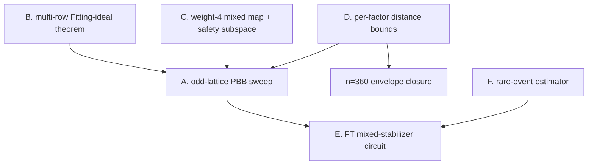

# Where the next substantially stronger results are — ranked, with first experiments

Written 2026-08-21 after Theorems J-G/J-H/J-I/J-J (EXP-053/054). Ranking is by
*expected information gain × payoff / cost*, not by appeal. Every entry names a
falsifiable prediction and the cheapest decisive first experiment, so a wrong
guess dies fast.

State that makes these live now:

* the single-row X-collapse channel is **completely classified** by one ideal
  ($I=\operatorname{Ann}_R(A,B)$): nilpotent → every direction collapses,
  idempotent → none, otherwise mixed (Theorem J-G);
* the collapse **cannot happen at all on odd$\times$odd lattices** (J-G1);
* it **cannot be partial** for weight-$\le3$ polynomials (J-I) — the entire
  published family — but is partial at weight 4 (J-J);
* on the Z-side the trade law $k_Q=k_P-T$ is exact on 138/139 certified parents,
  and 63 parents (incl. the Gross code) are family-closed.

---

## A. Odd-lattice PBB search — premise corrected, partly executed (EXP-055)

**Status 2026-08-21: the "unexplored region" premise was FALSE and is retracted.**
J-G1 does say the collapse hazard is structurally absent when $\ell,m$ are both
odd, and our own 202-parent catalogue really does live at $m\in\{3,6\}$. But the
claim that "$[[90,8,10]]$ on $(15,3)$ is the only odd$\times$odd BB instance in
the literature" was wrong: a novelty check found **at least 27 sourced
odd$\times$odd BB instances** in Wang–Mueller (arXiv:2408.10001v4),
Eberhardt–Steffan (arXiv:2407.03973v1), Postema–Kokkelmans (arXiv:2502.17052v4)
and Bravyi et al. (arXiv:2308.07915) — including $(9,9)\,[[162,8,12]]$,
$(9,15)\,[[270,8,18]]$, $(7,7)\,[[98,6,12]]$ and $(3,27)\,[[162,8,14]]$. The
region is *searched*; only our own catalogue avoided it.

**What was also already published:** the odd-lattice rate law itself. $R$
semisimple $\Rightarrow k=2\cdot\#\{\text{common roots}\}$ is
Panteleev–Kalachev (arXiv:1904.02703) Prop. 1 in the cyclic case,
Lin–Pryadko (arXiv:2306.16400) Eq. (47), Postema–Kokkelmans Thm. 2.6, and
Eberhardt–Steffan Cor. 2.11–2.12 ("if $\ell$ and $m$ are odd, all BB codes are
principal"). Claim it as reproduction, never as novelty.

**What survived and is now done (EXP-055).** Two things:

1. *A certified solver-free distance ceiling* (the exact pole isomorphism is
   published; its explicit use as a general-BB rejection oracle was not found).
   If $I=\operatorname{Ann}_{\rm left}(a,b)$ and $J=\bar I$ is the physical
   right-kernel pole, then $J^2\cong\ker H_X/S_Z$ exactly and
   $d\le\min\{\operatorname{wt}(u):0\ne u\in J\}$. Reduced pole-coset witnesses
   are self-certifying and much tighter. The isomorphism passes 27/27 literature
   audits; the ceiling has zero violations on five locally exact-certified rows
   (all 25 reported values also pass as a non-certifying sanity check).
2. *An exhaustive census*: all $65$ odd lattices with $\ell m\le180$,
   $4.23\times10^9$ weight-$\le3$ pairs, exact $k$ by two independent routes
   (zero mismatches), immunity re-verified ($273$ idempotence tests, zero
   violations).

**Screen verdict.** Complete through $n=126$: 715 symmetry classes / 10,247
pairs; all 598 classes with an independently exact reference are dominated
(588 explicit witnesses, 10 CP-SAT), 117 high-$k$ no-reference, zero survivors
or undecided. Three exact local references were promoted during closure:
$[[30,8,4]]$, $[[54,8,6]]$, $[[126,12,10]]$. The $[[30,8,4]]$ constructor is
new within checked BB tables but globally dominated by Grassl $[[30,8,7]]$.
The live extension is the distance screen at $n>126$; the first
$[[162,8,14]]$ exactification attempt timed out at 2,100s.

## B. Multi-row light channels: replace CP-SAT certificates with a theorem

**Gap.** J-E/J-G decide the *single-row* channel exactly and instantly. The
multi-row channel is decided today by a one-shot CP-SAT query per parent
(EXP-051); it is why `15_6_0256` and `30_6_0289` remain X-undecided, each
carrying a verified weight-8 channel.

**Target theorem.** Generalize J-E from rank-1 dressings $\lambda[C\,D]$ to
rank-$r$: with $\Delta$ the dressing submodule, characterize
$\exists w<d_X(P)$ in $\operatorname{rowspace}(H_X)\setminus\{\text{original
rows}\}$ that becomes logical, in terms of the ideals generated by
$r\times r$ minors of $[C\,D]$ over $R$ — a Nakayama/Fitting-ideal statement.
J-H's local decomposition $R_\chi=F_\chi[G_2]$ is the right coordinate system:
per factor the question becomes a small linear-algebra condition over $F_\chi$.

**Prediction.** The multi-row channel is empty whenever the *Fitting ideal* of
the dressing module is nilpotent — the exact analogue of J-G, testable
immediately against EXP-051's 8 INFEASIBLE certificates and the 2 witnesses.

**First experiment.** Compute the Fitting-ideal invariants for all 10 immune
parents and correlate with EXP-051's verdicts (8 empty / 2 nonempty). Cost:
hours. A clean correlation is strong evidence; a mismatch kills the conjecture
cheaply.

## C. Weight-4 mixed map, and the first *usable* PBB safety subspace

**Why it matters practically.** In a mixed parent the fixed set $S$ is a
*proper nonzero* subspace: perturbation directions inside $S$ provably cannot
demote, those outside provably do. That is the first structure that would let a
designer *use* the PBB freedom safely — pick $[C\,D]$ inside $S$ (dimension
$2\dim I^\infty$, explicitly computable). Today the only mixed instance is a
$[[12,8]]$ toy.

**Target.** The sharp weight/lattice map at weight 4: for which $(\ell,m)$ and
coset patterns does mixed occur, and is there a mixed parent with $k_P>0$ and
certified $d\ge6$ at $n\le180$?

**First experiment.** Weight-4 census with EXP-054's group-dedup algorithm
(per-polynomial invariants, then group$\times$group pair tests) on the catalogue
lattices; $\binom{\ell m-1}{3}$ normalised supports is $\le10^6$ per lattice, so
$(6,6),(9,6),(12,6),(6,9),(4,9)$ are directly feasible and $(15,6),(30,6),
(12,12),(15,12)$ need the cached invariants plus a coset-pattern prefilter
derived from J-H (only patterns with $\ge2$ occupied cosets and $\ge2$ points per
occupied coset can be mixed — a large pruning).

**Prediction from J-H.** Mixed at weight 4 requires a lattice with a nontrivial
$G_2$ *and* a nontrivial $G_{\rm odd}$ (so $(2^s,2^t)$-only and odd-only
lattices are excluded), and each of $A,B$ must be a product
$(1+h)\cdot(\text{odd-part polynomial with a character zero})$ up to
translation. That is a concrete constructive recipe — it can be tested by
building the recipe's outputs and checking `case == mixed` directly.

## D. Rate–distance obstruction from the ideal decomposition

**Status of the naive form: dead, recorded.** For immune parents all logical
classes live in the idempotent ideal $e_IR$ (a 2D cyclic code of GF(2)-dimension
$k_P/2$), which gives $d_X(P)\le\min\operatorname{wt}(e_IR\setminus 0)$. Measured
on all 10 immune parents: the ideal minimum weight is $18$ on $(9,6)$ and $30$ on
$(15,6),(30,6)$ against certified $d_P\in\{6,8,10\}$ — the bound is loose by
$2$–$3\times$ because $\ker H_X$ is strictly larger than $e_IR^2$ (syzygy pairs
$(u,v)$ with $\bar au=\bar bv\neq0$ carry the true minimum). Recorded in
`failed_routes.md`.

**Live version.** Bound the *coset* minimum in $\ker H_X/S_Z$ using the local
factor decomposition: on each factor the code is a small cyclic-code problem
over $F_\chi[G_2]$, and distances of 2D cyclic codes have classical bounds
(BCH-type over the character set). A per-factor bound would give the first
*algebraic* $d$-upper-bound for BB codes that does not require a solver — the
tool the envelope work has been missing at $n=360$.

**First experiment.** For the 10 immune parents and the Gross code, compute the
per-factor character supports and compare classical cyclic bounds against the
certified distances; look for the tightest factor.

## E. The decisive end-to-end item: a fault-tolerant mixed-stabilizer circuit

**Where it stands.** Theorem C6 proves *every* generating set of a catalogue PBB
$[[144,12,12]]$ has a symplectic-weight-$\ge8$ generator, so any one-ancilla
schedule needs $\ge8$ two-qubit layers against the Gross code's 7 — and no
fault-tolerant one-ancilla circuit for the mixed stabilizers was found in the
searched schedule space (EXP-009/016/031/036/039). **No impossibility is
claimed**, and that is the honest gap in the original assignment.

**Two routes, both concrete.** (i) *Construct*: allow depth $\ge8$ with flag
qubits or cat states, verify noiseless semantics, generate the DEM, and compute
or bound the circuit distance (the EXP-040 machinery already does mechanism
distance on flattened DEMs). (ii) *Prove*: a no-go for one-ancilla schedules of
mixed generators within a stated class — the incidence-counting route is already
refuted (ancilla-ancilla parity forwarding), so the lower bound must come from
the symplectic weight structure, i.e. from C6 plus a hook-error argument.

**Payoff.** Route (i) turns the provisional matched-MC pair (Gross
$6.33\times10^{-3}$ vs PBB $2.21\times10^{-2}$, disjoint CIs) into a real
end-to-end comparison. Route (ii) is a publication-grade no-go on its own.

## F. Rare-event estimator to finish the matched comparison

The matched Monte-Carlo grid is 1/10 cells complete because ordinary MC needs
too many shots at $p\le0.002$. A validated splitting / importance-sampling
estimator (with an overlap-regime calibration against ordinary MC and exact
enumeration on small circuits) both finishes the grid and is itself a
publication-grade deliverable under the assignment's criterion 9. Cost: days;
risk: estimator bias must be demonstrated controlled, not assumed.

---

## Ordering and dependencies

A is startable today with existing code; B and C are independent theory tracks
that make A's survivors trustworthy; D unlocks the last open envelope rows; E is
the end-to-end decision the assignment ultimately asks for, and F is what makes
E affordable.
